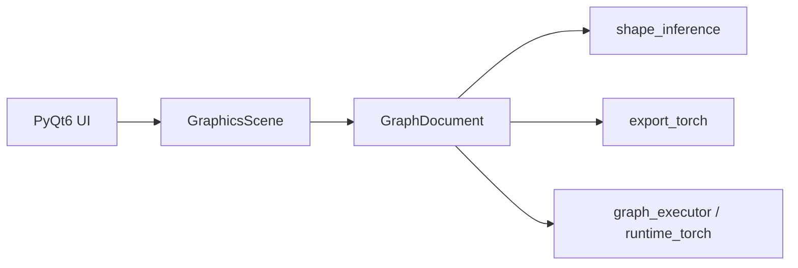

# dl_vis 设计说明（MVP）

## 1. 架构分层

| 层级 | 职责 | 状态 |
|------|------|------|
| 界面层 | `MainWindow`、多 Tab 画布、`QDockWidget` 参数面板 | 已实现 |
| 节点视图 | `NodeItem`、`EdgeItem`、`CanvasWidget` | 已实现 |
| 逻辑层 | `GraphDocument`、形状推导、`export_torch` | 部分 |
| 框架层 | PyTorch 导出、`runtime_torch` 前向/训练、`GraphExecutor` 雏形 | 部分 |



**数据文件约定（训练）**：`.npy` 方式要求 `X` 为 float32、形状 `(N,C,H,W)`，`y` 为 int64、形状 `(N,)`；CSV 方式要求每行前 `C×H×W` 列为特征（行主序展平后与当前图中 Input 的 C/H/W 一致），最后一列为整型标签，可选跳过首行表头。

## 2. 图模型

- **约束**：有向无环图（DAG）；添加边后若产生环则拒绝。
- **节点**：全局唯一 `id`（UUID 字符串）、`type`、`x`/`y` 场景坐标、`params` 字典。
- **边**：唯一 `id`、`src_id`、`dst_id`，可选 `src_port` / `dst_port`（默认 `out` / `in`），便于残差与多输入。
- **校验**：禁止自环；重复 `(src_id, dst_id)` 不允许。

## 3. JSON 序列化 Schema（草案）

文件根对象：

```json
{
  "schema_version": "1.0",
  "nodes": [
    {
      "id": "uuid",
      "type": "Conv3x3",
      "x": 120.0,
      "y": 80.0,
      "params": { "in_channels": 3, "out_channels": 64 }
    }
  ],
  "edges": [
    {
      "id": "uuid",
      "src_id": "...",
      "dst_id": "...",
      "src_port": "out",
      "dst_port": "in"
    }
  ]
}
```

| 字段 | 类型 | 说明 |
|------|------|------|
| `schema_version` | string | 当前 `1.0` |
| `nodes[].id` | string | 必填 |
| `nodes[].type` | string | 见下表 |
| `nodes[].x`, `y` | number | 场景坐标 |
| `nodes[].params` | object | 类型相关 |
| `edges[].id` | string | 必填 |
| `edges[].src_id`, `dst_id` | string | 必填 |

## 4. 节点类型与默认参数（第一阶段）

| type | 说明 | 备注 |
|------|------|------|
| Input | NCHW 占位 | batch/channels/height/width |
| Output | 输出头占位 | name / task / num_classes（0=继承末层 FC）/ loss |
| Conv3x3 / Conv1x1 | 卷积 | stride/padding/bias |
| MaxPool / AvgPool | 池化 | kernel/stride/padding |
| FC | 全连接 | in/out features |
| ReLU / Sigmoid / Softmax | 激活 | 按类型 |
| BN | BatchNorm | num_features 等 |
| Residual / Prune / Attention | 占位 | 无训练逻辑，参数仅文档/UI |

详细默认键值见 `dl_vis/model/node_types.py` 中 `DEFAULT_PARAMS` 与 `EDITABLE_FIELDS`。

## 5. 坐标与交互约定

- 节点矩形宽约 140×70（逻辑单位）；输出锚点为右侧中点，输入为左侧中点。
- 连线为场景坐标下的折线/贝塞尔路径，随节点移动更新。

## 6. 与 PyTorch 映射（预留）

- **Sequential**：线性链可映射为 `nn.Sequential`。
- **分支**：多条入边在第二阶段通过自定义 `Module` 或 `forward` 拼接语义生成代码。
- **Residual / Attention**：图中为独立节点类型；代码生成阶段展开（第一阶段不实现）。

## 7. 扩展（后续）

- **自定义算子**：注册表 `type → 参数 schema + 可选 forward 钩子`。
- **插件**：动态加载 Python 模块注册节点类型。

## 8. 阶段路线图

| 阶段 | 内容 |
|------|------|
| **当前 MVP** | 多 Tab、拖拽节点、连线、参数 Dock、JSON 存盘、形状推导占位、导出菜单占位 |
| **二（部分已落地）** | **已实现**：`QUndoStack` 快照撤销/重做；多选节点左/顶对齐；线性链 `nn.Sequential` 源码复制/保存；「可视化」Tab；**DAG 级 NCHW 推导**（`infer_shapes_dag_nchw` + `logic/topo_sort.py`）、汇合节点 **Add / Concat / Multiply**、**连线前形状校验**（不匹配拒绝连线）；一档线性链推导 API `infer_shapes_linear_nchw` 仍可用。**仍扩展中**：DAG 的 PyTorch 导出（自定义 `forward`）、完整 Matplotlib 热力图等。 |
| **三** | 训练子图、梯度钩子、插件加载 |

### 8.1 已实现能力摘要（形状推导）

- **一档（`infer_shapes_linear_nchw`）**：图中恰好一个 `Input`，且无分叉、无汇合（单路径）；沿链传播 NCHW；`FC` 若 `in_features ≠ C×H×W` 则记入 `warnings`。
- **DAG 档（`infer_shapes_dag_nchw`，对齐设计文档 §3.3.1）**：单 `Input`、无环 DAG；全图从 Input 可达；拓扑序上传播 NCHW；汇合节点 **Add / Multiply**（各路 NCHW 须一致）、**Concat**（`concat_dim`：0–3 对应 N/C/H/W，除拼接维外维度一致）；`check_graph_runnable` 与菜单「推导形状」、**画布连线**均使用本推导；不匹配时连线被拒绝。
- **导出与训练**：`export_torch` / `train_synthetic` 等仍为**线性 Sequential**；含 Add/Concat 的 DAG 需后续代码生成，导出会显式报错。

## 9. 执行子图与可视化（第三阶段语义草案）

以下为第三阶段实现前的约定草案，便于接口对齐。

### 9.1 GraphExecutor（草案与已实现雏形）

**已实现（代码）**：`dl_vis/logic/graph_executor.py` 中的 `GraphExecutor` 类为第三阶段草案的落地雏形：构造时只读持有 `GraphDocument`，提供 `build_model`、`dummy_forward`、`train_synthetic`、`load_npy_pair`、`load_csv_nchw_labels`、`train_with_arrays` 等方法；具体张量运算与校验委托 `dl_vis/logic/runtime_torch.py`（**形状检查**为 DAG 级 `infer_shapes_dag_nchw`；**构建模块**仍为 `nn.Sequential` 线性链、跳过链尾 Softmax 的 CE 训练、`.npy` 与 CSV 数据加载）。

**形状与可运行性**：DAG 图可通过形状检查但可能在 `export_to_torch_module` / 训练时因非线性拓扑失败，属预期；需后续自定义 `forward` 生成。

**仍属草案（未完全实现）**：

- **子图选定**：由用户指定节点集合 `S ⊆ nodes`，要求从「损失/输出」反向可达或从前向入口正向闭合（具体策略在实现时固定为一种）。当前 `GraphExecutor` 仅支持**整条线性链**对应的 `nn.Sequential`，尚未按任意子集 `S` 执行。
- **按节点注册的前向/反向**：按拓扑序对 `S` 内节点执行注册的 `forward` 钩子或内置算子映射、在 `S` 上对标量损失调用 `backward()` 等完整语义仍为规划；当前实现为 PyTorch 模块级 `forward`/`backward`。
- **与画布关系**：`GraphDocument` 仍为权威拓扑；Executor 只读文档 + 运行时缓存（已实现只读持有）。

### 9.2 hook（草案）

- **注册**：节点类型或实例可登记 `forward_hook(ctx) -> Tensor | None`，由执行器在前后向时调用。
- **可视化订阅**：UI/Matplotlib 层订阅 hook 暴露的中间张量引用（弱引用或句柄），用于热力图、梯度范数等；**不在第三阶段前强制实现**。

### 9.3 插件（草案）

- 动态 `importlib` 加载模块，调用约定入口（如 `register_nodes(registry)`）向全局注册表追加 `type`、默认参数 schema 与可选 `forward`。

## 10. 产品方向与文档索引

- **战略与差距分析**（画布「搭好就能跑」、图与代码双向、双子图架构草图）：见仓库内 [PRODUCT_DIRECTION.md](PRODUCT_DIRECTION.md)。
- **按版本的交付清单**：见 [ROADMAP.md](ROADMAP.md) 章节「〇、战略优先级」。
- 本节不重复业务决策，仅保证设计文档与产品文档可追溯。
