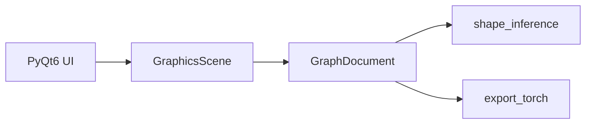

# dl_vis 设计说明（MVP）

## 1. 架构分层

| 层级 | 职责 | 第一阶段 |
|------|------|----------|
| 界面层 | `MainWindow`、多 Tab 画布、`QDockWidget` 参数面板 | 已实现 |
| 节点视图 | `NodeItem`、`EdgeItem`、`CanvasWidget` | 已实现 |
| 逻辑层 | `GraphDocument`、形状推导占位、导出占位 | 部分 |
| 框架层 | PyTorch 代码生成 / 执行 | 第二阶段 |



## 2. 图模型

- **约束**：有向无环图（DAG）；添加边后若产生环则拒绝。
- **节点**：全局唯一 `id`（UUID 字符串）、`type`、`x`/`y` 场景坐标、`params` 字典。
- **边**：唯一 `id`、`src_id`、`dst_id`，可选 `src_port` / `dst_port`（默认 `out` / `in`），便于残差与多输入。
- **校验**：禁止自环；重复 `(src_id, dst_id)` 不允许。

## 3. JSON 序列化 Schema（草案）

文件根对象：

```json
{
  "schema_version": "1.0",
  "nodes": [
    {
      "id": "uuid",
      "type": "Conv3x3",
      "x": 120.0,
      "y": 80.0,
      "params": { "in_channels": 3, "out_channels": 64 }
    }
  ],
  "edges": [
    {
      "id": "uuid",
      "src_id": "...",
      "dst_id": "...",
      "src_port": "out",
      "dst_port": "in"
    }
  ]
}
```

| 字段 | 类型 | 说明 |
|------|------|------|
| `schema_version` | string | 当前 `1.0` |
| `nodes[].id` | string | 必填 |
| `nodes[].type` | string | 见下表 |
| `nodes[].x`, `y` | number | 场景坐标 |
| `nodes[].params` | object | 类型相关 |
| `edges[].id` | string | 必填 |
| `edges[].src_id`, `dst_id` | string | 必填 |

## 4. 节点类型与默认参数（第一阶段）

| type | 说明 | 备注 |
|------|------|------|
| Input | NCHW 占位 | batch/channels/height/width |
| Output | 输出头占位 | name |
| Conv3x3 / Conv1x1 | 卷积 | stride/padding/bias |
| MaxPool / AvgPool | 池化 | kernel/stride/padding |
| FC | 全连接 | in/out features |
| ReLU / Sigmoid / Softmax | 激活 | 按类型 |
| BN | BatchNorm | num_features 等 |
| Residual / Prune / Attention | 占位 | 无训练逻辑，参数仅文档/UI |

详细默认键值见 `dl_vis/model/node_types.py` 中 `DEFAULT_PARAMS` 与 `EDITABLE_FIELDS`。

## 5. 坐标与交互约定

- 节点矩形宽约 140×70（逻辑单位）；输出锚点为右侧中点，输入为左侧中点。
- 连线为场景坐标下的折线/贝塞尔路径，随节点移动更新。

## 6. 与 PyTorch 映射（预留）

- **Sequential**：线性链可映射为 `nn.Sequential`。
- **分支**：多条入边在第二阶段通过自定义 `Module` 或 `forward` 拼接语义生成代码。
- **Residual / Attention**：图中为独立节点类型；代码生成阶段展开（第一阶段不实现）。

## 7. 扩展（后续）

- **自定义算子**：注册表 `type → 参数 schema + 可选 forward 钩子`。
- **插件**：动态加载 Python 模块注册节点类型。

## 8. 阶段路线图

| 阶段 | 内容 |
|------|------|
| **当前 MVP** | 多 Tab、拖拽节点、连线、参数 Dock、JSON 存盘、形状推导占位、导出菜单占位 |
| **二** | 撤销/重做、对齐、完整 shape、PyTorch 导出、Matplotlib 可视化 |
| **三** | 训练子图、梯度钩子、插件加载 |

## 9. 执行子图与可视化（仅文档）

- **GraphExecutor**：从指定节点集合对损失求导等语义在第二阶段定义。
- **hook**：节点可选注册张量引用供热力图订阅（未实现）。
