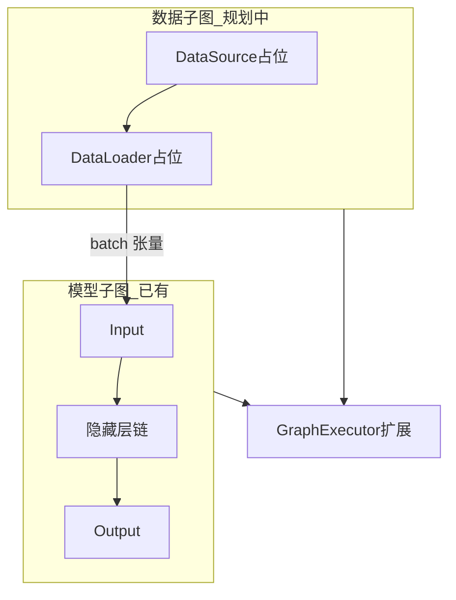

# 产品方向与解题思路

> 与 [DESIGN.md](DESIGN.md)（技术细节）和 [ROADMAP.md](ROADMAP.md)（里程碑表）配合阅读。  
> 本文回答：**要达成什么**、**当前差在哪**、**按什么顺序补**。

## 1. 北极星目标（两条主线）

### 主线 A：画布上「搭好就能跑」

用户用 Input、若干隐藏层、Output，再接入**数据与训练语义**后，应能在本工具内直接训练或前向试跑，而不仅依赖菜单里的对话框式配置。

- **现状**：网络拓扑在画布；数据来源与训练参数主要在「运行 → 合成数据训练」对话框中完成（合成 / `.npy` / CSV）。执行路径见 `GraphExecutor` + `runtime_torch.py` + `training_worker.py`。
- **差距**：画布上没有「数据集 / DataLoader / 优化器」等一等公民节点；训练循环仍是整批张量或合成数据，与「流程图即管线」的直觉不一致。
- **方向**：引入**训练管线子图**（数据 → 可选变换 → 批处理 → 接 Input），与现有**模型子图**（Input → 算子链 → Output）在文档与实现上分轨后合并执行（见第 3 节架构草图）。

### 主线 B：图与代码双向连通

- **图 → 代码**：在现行线性链之外，支持 DAG（分支 / 汇合）生成可运行的 `nn.Module` 或清晰的多分支 `forward`（见 `export_torch.py` 扩展）。
- **代码 → 图**：对 **PyTorch 模型**优先采用 `torch.fx.symbolic_trace`（或手写 AST + 受限模板）将可追踪模块转为与 `GraphDocument` 对齐的结构化图，再交给现有画布渲染。

两条主线独立推进，但共享同一 **`GraphDocument` + JSON** 持久化与 **UI 画布**。

## 2. 问题拆解：「能跑」的最低条件（当前实现）

要在当前版本下成功训练，需同时满足（实现均在 `runtime_torch.py` / `shape_inference.py`）：

1. **恰好一个 `Input` 节点**，且拓扑为**单路径线性链**（无分叉、无汇合）。
2. **`Output` 节点**：任务与损失为当前已实现的占位组合（`classify` + `cross_entropy`）；类别数与末层 `FC` 的 `out_features` 一致或由 `num_classes` 显式指定且一致。
3. **已安装 PyTorch**；真实数据需符合 [DESIGN.md](DESIGN.md) 中对 `.npy` / CSV 的约定。

若仅「随便搭」而未接好 `Output`/数据格式，会表现为运行失败或对话框校验不通过——这不是单点 bug，而是**产品尚未把「数据 + 网络 + 损失」完整铺到画布上**。

## 3. 推荐架构：双子图 + 统一执行器（解题思路）

- **短期**：保留对话框配置数据路径；在文档中明确「画布 = 模型，对话框 = 数据入口」。
- **中期**：新增节点类型与 `runtime_torch` 中的构建函数，从 `GraphDocument` 解析出 `DataLoader` 与优化器配置，替换硬编码的 `Adam` / 整图单批逻辑。
- **长期**：训练循环、验证拆分成可拓扑排序的执行计划（可能需边类型区分数据流与控制流）。

## 4. 与代码目录的对应关系

| 目标 | 主要改动位置 |
|------|----------------|
| 新节点类型与参数面板 | `model/node_types.py`，`ui/palette.py`，`main_window.py`（属性表单） |
| 形状与新拓扑校验 | `logic/shape_inference.py` |
| 构建 Module / 训练 | `logic/export_torch.py`，`logic/runtime_torch.py`，`logic/graph_executor.py` |
| UI 训练入口 | `ui/main_window.py`，`ui/training_worker.py` |
| 图 ↔ 代码导入 | 新建建议：`logic/import_torch.py`（fx），与 `export_torch.py` 对称 |

## 5. Dock 面板异常（右上角无法拖动/关闭）

Qt 停靠窗口可能被拖成浮动窗口或停靠区异常。

- **产品内**：菜单「视图 → 重置停靠面板布局」将左右 Dock 重新挂到默认区域并取消浮动（见主窗口实现）。
- **系统级**：若仍异常，可删除本机 Qt 可能写入的窗口状态缓存（因项目未持久化布局，多数情况重置菜单即可）。

## 6. 文档维护约定

- **DESIGN.md**：协议、Schema、与实现一致的语义。
- **ROADMAP.md**：按版本的交付清单与优先级。
- **本文**：战略取舍与「为何这样拆问题」；每次重大方向讨论后更新一节。
